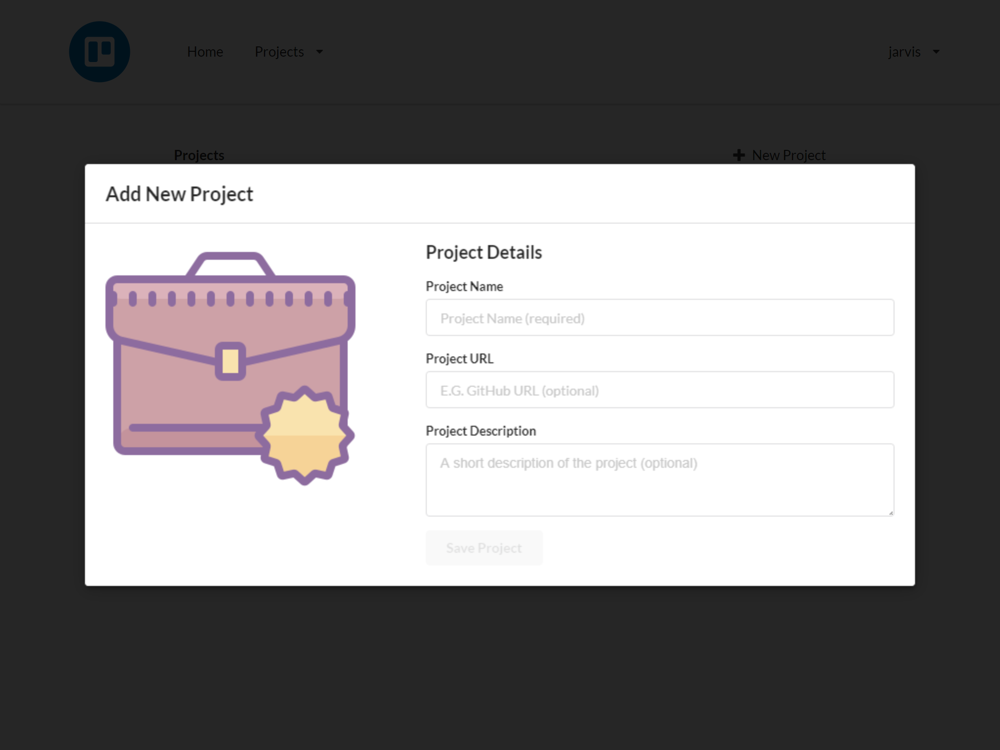
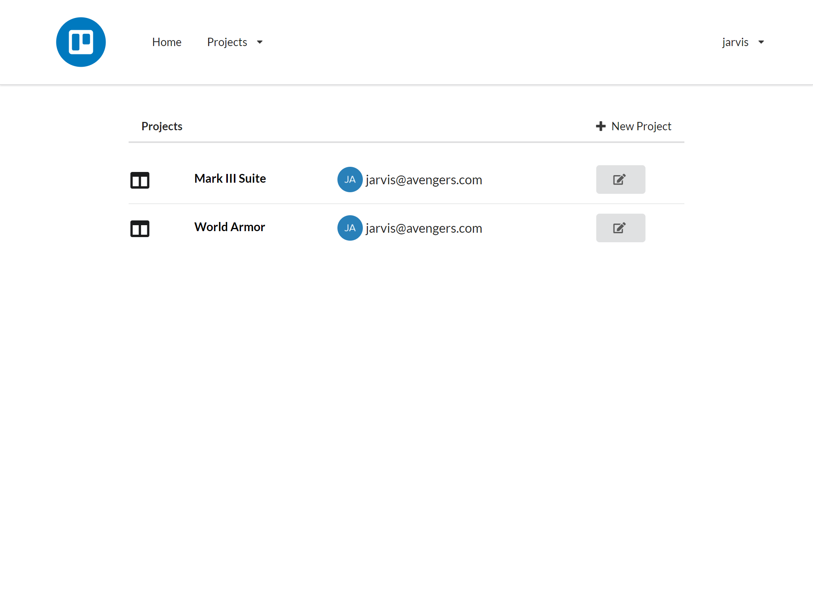

<h1 align="center">A Simple Jira-like Clone built with React and GraphQL</h1>

<div align="center">Formatted with Prettier, type generated by GraphQL-Codegen</div>

<h3 align="center">
  <a href="https://jira-clone-slash.netlify.app/">View Live Demo</a> |
  <a href="https://github.com/verneleem/jira-clone/blob/master/auth0Rules/ProcessLogin.js">Auth0 Rule</a> |
  <a href="https://github.com/verneleem/jira-clone/tree/master/slashSchema">GraphQL Schema</a> |
  <a href="https://github.com/verneleem/jira-clone/tree/master/src">Front End</a>
</h2>


Tech stack:

- Frontend
  - [React](https://reactjs.org/)
  - [Typescript](https://www.typescriptlang.org/)
  - [Semantic UI React](https://react.semantic-ui.com/)
  - [React Router Dom](https://reactrouter.com/web/guides/quick-start)
  - [Apollo client v3.0](https://www.apollographql.com/docs/)
  - [GraphQL Code Generator](https://graphql-code-generator.com/)
  - [Auth0 React](https://www.npmjs.com/package/@auth0/auth0-react)
  - [React Beautiful DND](https://github.com/atlassian/react-beautiful-dnd)
- Backends:
  - [Auth0](https://auth0.com/)
  - [Slash GraphQL](https://dgraph.io/graphql)

## What is this and who is it for

This Single Page Application, SPA, was created to showcase how GraphQL can be used in a React application without running a GraphQL backend with Node and Express. In this application we cloud managed services to deliver this application without needing to setup and configure any server resources ourselves. We have done this with the capabilities of Netlify to build and deliver the front-end and use Auth0 and Slash GraphQL for a backend solution.

There are other React, Typescript, Semantic-UI, and GraphQL showcases available, but this is unique to it being a fully cloud hosted environment for both the front end and the backends. We hope to showcase our code in an understandable manner. This is not a complete JIRA clone, but rather only a Project Kanban application. Feel free to fork this project and modify it for your own use cases to help you learn or start your own SPA.

## Screenshots





## The Tech Stack Choice

Why did we choose this tech stack?

### React

React allows development to be fast, scalable, and simple. Being a component based library, it helps separating logistical elements of the application into its own parts. React is JavaScript which allows us to manage application state easily on the client's device and deliver a serverless application.

### Semantic UI

Semantic UI allows development to be beautiful, responsive, and developer friendly. Nobody wants an ugly website, and developers don't want to spend all of their time focusing on design. A good website has both a builder and an architect. Semantic UI allows us to focus on building and leverage their tools as the architect.

### GraphQL

GraphQL allows development to evolve, move faster, and be precise. GraphQL being a replacement for RESTful APIs provides a single endpoint for the client. GraphQL's type system and query language, allows the client to ask for only what it wants and as much as it wants with a single request. GraphQL allows us to store and request the data in the shape that our application will consume the data.

### Apollo Client

Apollo Client allows development to seamlessly cache responses from the API. Client side caching an API can be a hard task to do correctly. There are many factors to consider when caching requests into a single store. Apollo Client allows us to focus on using the data requested instead of managing the cache of the API responses.

### Typescript

Typescript adds a layer of control on top of JavaScript. Using a typed system already for the API, it makes sense to use strict types in the Frontend application. TypeScript allows us to evolve our application while maintaining our sanity.

### GraphQL Code Generator

GraphQl Code Generator is the glue that ties together Typescript, Apollo Client, and a GraphQL API. With some small configuration, GraphQL Code Generator will introspect an API and build a complete set of type definitions for TypeScript. It can also read `.graphql` operation files in your source code and generate custom hooks for use with Apollo Client and React. GraphQL Code Generator allows us to quickly change our API and sync those changes with our frontend.

### React Beautiful DND

React Beautiful DND provides a toolset to create drag and drop lists that are beautiful and accessible. React Beautiful DND takes the burden off from the developer to create all of the methods to drag and drop elements between lists. With event listeners a developer can quickly attack action scripts for when elements are dropped between lists and even reordered within their own list. React Beautiful DND allows us to focus on the actions of handling updates in our boards, columns, and tickets instead of worrying about the actual methods to move the elements in the DOM.

### Auth0

Auth0 adds a complete and secure authentication method to the application. Authentication done correctly can become painstakingly complicated and time consuming. Auth0 removes the complication of authenticating users. Auth0 is an easy to implement, adaptable authentication and authorization platform. Auth0 allows us to authenticate users. Authentication requests respond to the client with a signed JWT that is then used with requests to the GraphQL API to authorize data back to the client.

### Slash GraphQL

Slash GraphQL is a fully managed GraphQL backend service. Slash GraphQL is one of the DBaaS offered by Dgraph.io serving a graph database. With Slash GraphQL, the GraphQL API is not another layer on top of the database, but rather and endpoint built within the database's core. Dgraph's GraphQL API has built in middleware with developer written rules. Slash GraphQL allows us to define our types for our schema alone, and benefit with a full CRUD generated GraphQL API.

## Forking and running this application locally

[Fork this project](https://docs.github.com/en/github/getting-started-with-github/fork-a-repo) into your own Github account.
[Clone the project](https://docs.github.com/en/github/getting-started-with-github/fork-a-repo#step-2-create-a-local-clone-of-your-fork) onto your local machine.

Integrate with Auth0:

1. Sign up for Auth0 at https://auth0.com/
2. Create a new Application (use Single Page Application type)
3. Go to you Application's Settings
4. Set the `Allowed Callback URLs`, `Allowed Logout URLs`, and `Allowed Web Origins` to `http://localhost:3000/` (and/or your production deployed URL)
5. Copy the Domain and paste into [`.env.development`](./.env.development) and [`.env.production`](./.env.production) as `REACT_APP_AUTH0_DOMAIN`
6. Copy the Client ID and paste into [`.env.development`](./.env.development) and [`.env.production`](./.env.production) as `REACT_APP_AUTH0_CLIENT_ID`
7. Copy the Client ID and paste into the last line of [`/slashSchema/schema.graphql`](./slashSchema/schema.graphql) replacing the value for the key `Audience`. (This should still be wrapped inside of an array e.g. `"Audience":["your Client ID"]`)
8. Download your .pem certificate from `[Domain]/pem` and save to a local file not in the repo
9. Open this downloaded .pem file in your favorite text editor (We recommend Visual Studio Code)
10. Replace all line breaks with the `\n` characters. (e.g. `-----BEGIN CERTIFICATE-----\n...\n...\n-----END CERTIFICATE-----`)
11. Copy the updated contents of the file from the previous step and Paste into the last line of [`/slashSchema/schema.graphql`](./slashSchema/schema.graphql) replacing the value for the key `VerificationKey`

Integrate with Slash GraphQL:

1. Sign up for Slash GraphQL at https://slash.dgraph.io/
2. Create a new Backend.
3. Copy the GraphQL Backend URL to [`.env.development`](./.env.development) and [`.env.production`](./.env.production) as `REACT_APP_GRAPHQL_ENDPOINT`
4. Decide if you want to use a different Claims key. If not, skip to step 7
5. Enter a new unique Claims Key into [`.env.development`](./.env.development) and [`.env.production`](./.env.production) as `REACT_APP_AUTH0_CLAIMS_KEY`
6. Copy this Claims Key into the last line of [`/slashSchema/schema.graphql`](./slashSchema/schema.graphql) replacing the value for the key `Namespace`
7. Save the [`/slashSchema/schema.graphql`](./slashSchema/schema.graphql) file and copy its contents.
8. Paste the schema content into your Slash GraphQL Backend at https://slash.dgraph.io/_/schema.
9. Click on the `Deploy` button.

Generating Types:

If you modify your GraphQL schema (other than changing the Dgraph.Authorization line) or if you add, change, or remove
any of the operations.graphql files, you should generate new Types. This process will add new Typescript types as well
as generating Apollo Client hooks making CRUD operations easier to implement. To generate new types follow these steps:

1. Copy your GraphQL Backend URL and paste it into [`/codegen.yml`](./codegen.yml) as the value for the `schema` key.
2. If you no longer have any `src/**/*.graphql` files, change `withHooks` to `false` to prevent errors.
3. From the command line in your repo's directory, run `npm run generate-types`

Launch the Application:

One of the best parts about a React application is the ease to develop on your local machine. To run your application,

1. Open your favorite command line tool
2. Run `npm run start`. This will start the application and open your browser pointed to `https://localhost:3000`

## Starting an app like this from scratch

Do you want to start your own React, Slash GraphQL, Apollo, and Auth0 application? Here are the steps:

- Install [Node.js](https://nodejs.org/)

- Open the command line or alternatively the terminal in your favorite IDE (i.e.: [Visual Studio Code](https://code.visualstudio.com/))

- Use Create React App to quickly build the core React setup using the typescript template:

```sh
npx create-react-app your-app-name --template typescript
```

- Change directory to your newly created React Application:

```sh
cd your-app-name
```

- Install Production Packages: [Apollo Client](https://www.npmjs.com/package/apollo-client), [Auth0-React](https://www.npmjs.com/package/@auth0/auth0-react), [Markdown-to-JSX](https://www.npmjs.com/package/markdown-to-jsx), [React-Beautiful-DND](https://www.npmjs.com/package/react-beautiful-dnd), [React-Router-DOM](https://www.npmjs.com/package/react-router-dom), [Semantic-UI-React](https://www.npmjs.com/package/semantic-ui-react) and [CSS](https://www.npmjs.com/package/semantic-ui-css) dependency

```sh
npm install @apollo/client @auth0/auth0-react graphql markdown-to-jsx react-beautiful-dnd react-router-dom semantic-ui-react semantic-ui-css
```

- Install Developer Environment tools: [GraphQL-Codegen](https://www.npmjs.com/package/@graphql-codegen/cli) with the [add](https://www.npmjs.com/package/@graphql-codegen/add), [introspection](https://www.npmjs.com/package/@graphql-codegen/introspection), [typescript](https://www.npmjs.com/package/@graphql-codegen/typescript), [typescript-operations](https://www.npmjs.com/package/@graphql-codegen/typescript-operations) plugins and the [near-operation-file](@graphql-codegen/near-operation-file-preset) preset, [typescript-react-apollo](https://www.npmjs.com/package/@graphql-codegen/typescript-react-apollo), along with TypeScript definitions for [React-Beautiful-DND](https://www.npmjs.com/package/@types/react-beautiful-dnd), [React-Router-DOM](https://www.npmjs.com/package/@types/react-router-dom), and [Semantic-UI](https://www.npmjs.com/package/@types/semantic-ui)

```sh
npm install --save-dev @graphql-codegen/add @graphql-codegen/cli @graphql-codegen/introspection @graphql-codegen/near-operation-file-preset @graphql-codegen/typescript @graphql-codegen/typescript-operations @graphql-codegen/typescript-react-apollo @types/react-beautiful-dnd @types/react-router-dom @types/semantic-ui
```

- Develop a GraphQL Schema and deploy to Slash GraphQL [introduction video](https://youtu.be/Z4pkdodL62I)

- Write `.graphql` operation files with queries and mutations. Example at [./src/components/Board/operations.graphql](./src/components/Board/operations.graphql)

- Use GraphQL Code Generator to generate types, hooks, components, and HOCs for your project.

  - Copy the [codegen.yml](./codegen.yml) config file and replace the schema value with your GraphQL API url.

  - Alternatively initialize with the codegen script:

```sh
npm graphql-codegen init
```

> Note: If you enabled withHooks but don't have any .graphql files it will cause errors

- Set up scripts in `/package.json`

```json
"scripts": {
    ...
    "generate-types": "graphql-codegen --config codegen.yml"
}
```

- From a command line terminal within your project's directory run:

```sh
npm run generate-types
```

> Note: Anytime your types change or you add a new query/mutation to a .graphql file in the app, you should run the above command for GraphQL Code Generator to regenerate.

- Launch the application with:

```sh
npm start
```

### Feel free to browse the code in this repository to see how we implemented the following:

- Wrapped the App with the Auth0 Provider in `/src/index.tsx`
- Configured the Apollo Client with `/src/ApolloConfig.tsx`
- Added Apollo Provider in `/src/App.tsx`
- Created Routes with BrowserRoutes in `/src/App.tsx`
- Added Beautiful DND Context around the Kanban boards in `/src/components/Board/board.tsx`
- Added Draggables and Droppables in `/src/components/Column/column.tsx` and `/src/components/Ticket/ticket.tsx`
- Use the generated GraphQL types and Apollo hooks throughout the components based on the `operations.graphql` files.
